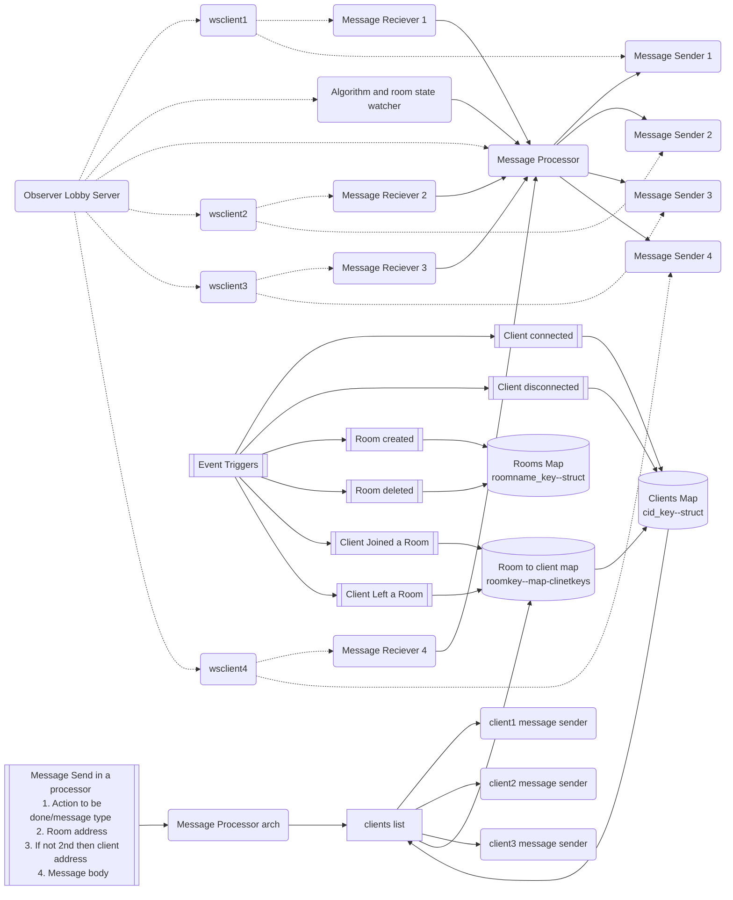

# gomeshstream
Golang package to push messages to clients , handle rooms and events . Part from words battle game

Extract from https://github.com/DhruvikDonga/wordsbattle

Still in development phases

## Proposed Architecture

